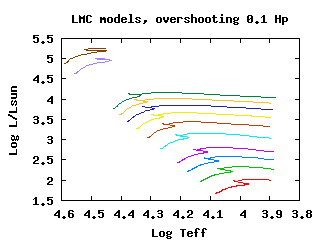

# Introduction

All models presented in this page are from
<a href="http://cdsads.u-strasbg.fr/cgi-bin/nph-bib_query?bibcode=2002A%26A...392..169C&amp;db_key=AST&amp;high=41af3cecf120971">
Cordier et al. (2002)</a> and 
<a href="http://adsabs.harvard.edu/cgi-bin/nph-bib_query?bibcode=2003A%26A...409..491C&amp;db_key=AST&amp;high=40c4745bba00377">
Cordier et al. (2003)</a>, the assumptions are:

<ul>
    <li><b>Evolutionary code</b>: CESAM (Henhey type, 1D code, see Morel 1997)</li>
    <li><b>Equation of State</b> (EOS): EFF (see Eggleton et al. 1973)</li>
    <li><b>Opacity tables</b>: OPAL 96 (Iglesias 1996), Alexander and Fergusson (1994) (for T < 10,000 K), 
        and Los Alamos (Magee et al. 1995)</li>
    <li><b>Mixing Length</b>: 1.6 Hp</li>
    <li><b>Overshooting</b>: it depends on the grid of models (see below)</li>
    <li><b>Chemical composition</b>: it depends on the grid of models (see below)</li>
</ul>

Compared to the grids of original papers, some models have been lost, due to digital archive
failure.

# Tracks from Cordier *et al*. (2003)

<b>Masses:</b> 2.2, 2.5, 3.0, 3.5, 4.0, 4.5, 5.0, 5.5, 6.0, 7.0, 8.0, 10.0 solar masses 
<b>Chemical composition:</b> X=0.754 Y=0.245 <b>Z=0.001</b> 
<b>Overshooting:</b> 0.2 Hp 
 
To enlarge, click on the figure.

<ul>
<li><a href="ceph_web/M2.2_0.001_0.2.out_web">M2.2_0.001_0.2.out_web</a></li>
<li><a href="ceph_web/M2.5_0.001_0.2.out_web">M2.5_0.001_0.2.out_web</a></li>
<li><a href="ceph_web/M3.0_0.001_0.2.out_web">M3.0_0.001_0.2.out_web</a></li>
<li><a href="ceph_web/M3.5_0.001_0.2.out_web">M3.5_0.001_0.2.out_web</a></li>
<li><a href="ceph_web/M4.0_0.001_0.2.out_web">M4.0_0.001_0.2.out_web</a></li>
<li><a href="ceph_web/M4.5_0.001_0.2.out_web">M4.5_0.001_0.2.out_web</a></li>
<li><a href="ceph_web/M5.0_0.001_0.2.out_web">M5.0_0.001_0.2.out_web</a></li>
<li><a href="ceph_web/M5.5_0.001_0.2.out_web">M5.5_0.001_0.2.out_web</a></li>
<li><a href="ceph_web/M6.0_0.001_0.2.out_web">M6.0_0.001_0.2.out_web</a></li>
<li><a href="ceph_web/M7.0_0.001_0.2.out_web">M7.0_0.001_0.2.out_web</a></li>
<li><a href="ceph_web/M8.0_0.001_0.2.out_web">M8.0_0.001_0.2.out_web</a></li>
<li><a href="ceph_web/M10.0_0.001_0.2.out_web">M10.0_0.001_0.2.out_web</a></li>
</ul>

<b>Masses:</b> 2.5, 3.0, 5.0, 10.0 solar masses 
<b>Chemical composition:</b> X=0.754 Y=0.245 <b>Z=0.001</b> 
<b>Overshooting:</b> 0.4 Hp 
 
To enlarge, click on the figure.

<ul>
<li><a href="ceph_web/M2.5_0.001_0.4.out_web">M2.5_0.001_0.4.out_web</a></li>
<li><a href="ceph_web/M3.0_0.001_0.4.out_web">M3.0_0.001_0.4.out_web</a></li>
<li><a href="ceph_web/M5.0_0.001_0.4.out_web">M5.0_0.001_0.4.out_web</a></li>
<li><a href="ceph_web/M10.0_0.001_0.4.out_web">M10.0_0.001_0.4.out_web</a></li>
</ul>

<b>Masses:</b> 2.5, 3.0, 3.5, 4.0, 4.5, 5.0, 5.5, 6.0, 7.0, 8.0, 10.0 solar masses 
<b>Chemical composition:</b> X=0.745 Y=0.251 <b>Z=0.004</b> 
<b>Overshooting:</b> 0.2 Hp 
 
To enlarge, click on the figure.

<ul>
<li><a href="ceph_web/M2.5_0.004_0.2.out_web">M2.5_0.004_0.2.out_web</a></li>
<li><a href="ceph_web/M3.0_0.004_0.2.out_web">M3.0_0.004_0.2.out_web</a></li>
<li><a href="ceph_web/M3.5_0.004_0.2.out_web">M3.5_0.004_0.2.out_web</a></li>
<li><a href="ceph_web/M4.0_0.004_0.2.out_web">M4.0_0.004_0.2.out_web</a></li>
<li><a href="ceph_web/M4.5_0.004_0.2.out_web">M4.5_0.004_0.2.out_web</a></li>
<li><a href="ceph_web/M5.0_0.004_0.2.out_web">M5.0_0.004_0.2.out_web</a></li>
<li><a href="ceph_web/M5.5_0.004_0.2.out_web">M5.5_0.004_0.2.out_web</a></li>
<li><a href="ceph_web/M6.0_0.004_0.2.out_web">M6.0_0.004_0.2.out_web</a></li>
<li><a href="ceph_web/M7.0_0.004_0.2.out_web">M7.0_0.004_0.2.out_web</a></li>
<li><a href="ceph_web/M8.0_0.004_0.2.out_web">M8.0_0.004_0.2.out_web</a></li>
<li><a href="ceph_web/M10.0_0.004_0.2.out_web">M10.0_0.004_0.2.out_web</a></li>
</ul>

# Models for Small Magellanic Cloud (SMC) Metallicity (Cordier *et al*. 2002)
 

## Overshooting 0.0 Hp

Masses: 2.5, 3.0, 3.5, 4.0, 5.0, 6.0, 7.0, 8.0, 9.0, 10.0, 11.0, 15.0, 20.0 and 25.0. 
 
To enlarge, click on the figure.

<ul>
<li><a href="SMC_web/M2.5_0.004_0.0.out_web">M2.5_0.004_0.0.out_web</a></li>
<li><a href="SMC_web/M3.0_0.004_0.0.out_web">M3.0_0.004_0.0.out_web</a></li>
<li><a href="SMC_web/M3.5_0.004_0.0.out_web">M3.5_0.004_0.0.out_web</a></li>
<li><a href="SMC_web/M4.0_0.004_0.0.out_web">M4.0_0.004_0.0.out_web</a></li>
<li><a href="SMC_web/M5.0_0.004_0.0.out_web">M5.0_0.004_0.0.out_web</a></li>
<li><a href="SMC_web/M6.0_0.004_0.0.out_web">M6.0_0.004_0.0.out_web</a></li>
<li><a href="SMC_web/M7.0_0.004_0.0.out_web">M7.0_0.004_0.0.out_web</a></li>
<li><a href="SMC_web/M8.0_0.004_0.0.out_web">M8.0_0.004_0.0.out_web</a></li>
<li><a href="SMC_web/M9.0_0.004_0.0.out_web">M9.0_0.004_0.0.out_web</a></li>
<li><a href="SMC_web/M10.0_0.004_0.0.out_web">M10.0_0.004_0.0.out_web</a></li>
<li><a href="SMC_web/M11.0_0.004_0.0.out_web">M11.0_0.004_0.0.out_web</a></li>
<li><a href="SMC_web/M15.0_0.004_0.0.out_web">M15.0_0.004_0.0.out_web</a></li>
<li><a href="SMC_web/M20.0_0.004_0.0.out_web">M20.0_0.004_0.0.out_web</a></li>
<li><a href="SMC_web/M25.0_0.004_0.0.out_web">M25.0_0.004_0.0.out_web</a></li>
</ul>

## Overshooting 0.1 Hp

Masses: 2.5, 3.0, 3.5, 4.0, 5.0, 6.0, 7.0, 8.0, 9.0, 10.0 and 11.0. 
 
To enlarge, click on the figure.

<ul>
<li><a href="SMC_web/M2.5_0.004_0.1.out_web">M2.5_0.004_0.1.out_web</a></li>
<li><a href="SMC_web/M3.0_0.004_0.1.out_web">M3.0_0.004_0.1.out_web</a></li>
<li><a href="SMC_web/M3.5_0.004_0.1.out_web">M3.5_0.004_0.1.out_web</a></li>
<li><a href="SMC_web/M4.0_0.004_0.1.out_web">M4.0_0.004_0.1.out_web</a></li>
<li><a href="SMC_web/M5.0_0.004_0.1.out_web">M5.0_0.004_0.1.out_web</a></li>
<li><a href="SMC_web/M6.0_0.004_0.1.out_web">M6.0_0.004_0.1.out_web</a></li>
<li><a href="SMC_web/M7.0_0.004_0.1.out_web">M7.0_0.004_0.1.out_web</a></li>
<li><a href="SMC_web/M8.0_0.004_0.1.out_web">M8.0_0.004_0.1.out_web</a></li>
<li><a href="SMC_web/M9.0_0.004_0.1.out_web">M9.0_0.004_0.1.out_web</a></li>
<li><a href="SMC_web/M10.0_0.004_0.1.out_web">M10.0_0.004_0.1.out_web</a></li>
<li><a href="SMC_web/M11.0_0.004_0.1.out_web">M11.0_0.004_0.1.out_web</a></li>
</ul>

## Overshooting 0.2 Hp

Available masses: 2.5, 3.0, 3.5, 4.0, 5.0, 6.0, 7.0, 8.0, 9.0, 10.0 and 11.0. 
 
To enlarge, click on the figure.

<ul>
<li><a href="SMC_web/M2.5_0.004_0.2.out_web">M2.5_0.004_0.2.out_web</a></li>
<li><a href="SMC_web/M3.0_0.004_0.2.out_web">M3.0_0.004_0.2.out_web</a></li>
<li><a href="SMC_web/M3.5_0.004_0.2.out_web">M3.5_0.004_0.2.out_web</a></li>
<li><a href="SMC_web/M4.0_0.004_0.2.out_web">M4.0_0.004_0.2.out_web</a></li>
<li><a href="SMC_web/M5.0_0.004_0.2.out_web">M5.0_0.004_0.2.out_web</a></li>
<li><a href="SMC_web/M6.0_0.004_0.2.out_web">M6.0_0.004_0.2.out_web</a></li>
<li><a href="SMC_web/M7.0_0.004_0.2.out_web">M7.0_0.004_0.2.out_web</a></li>
<li><a href="SMC_web/M8.0_0.004_0.2.out_web">M8.0_0.004_0.2.out_web</a></li>
<li><a href="SMC_web/M9.0_0.004_0.2.out_web">M9.0_0.004_0.2.out_web</a></li>
<li><a href="SMC_web/M10.0_0.004_0.2.out_web">M10.0_0.004_0.2.out_web</a></li>
<li><a href="SMC_web/M11.0_0.004_0.2.out_web">M11.0_0.004_0.2.out_web</a></li>
</ul>

## Overshooting 0.3 Hp

Available masses: 2.5, 3.0, 3.5, 4.0, 5.0, 6.0, 7.0, 8.0, 9.0, 10.0 and 11.0. 
 
To enlarge, click on the figure.

<ul>
<li><a href="SMC_web/M2.5_0.004_0.3.out_web">M2.5_0.004_0.3.out_web</a></li>
<li><a href="SMC_web/M3.0_0.004_0.3.out_web">M3.0_0.004_0.3.out_web</a></li>
<li><a href="SMC_web/M3.5_0.004_0.3.out_web">M3.5_0.004_0.3.out_web</a></li>
<li><a href="SMC_web/M4.0_0.004_0.3.out_web">M4.0_0.004_0.3.out_web</a></li>
<li><a href="SMC_web/M5.0_0.004_0.3.out_web">M5.0_0.004_0.3.out_web</a></li>
<li><a href="SMC_web/M6.0_0.004_0.3.out_web">M6.0_0.004_0.3.out_web</a></li>
<li><a href="SMC_web/M7.0_0.004_0.3.out_web">M7.0_0.004_0.3.out_web</a></li>
<li><a href="SMC_web/M8.0_0.004_0.3.out_web">M8.0_0.004_0.3.out_web</a></li>
<li><a href="SMC_web/M9.0_0.004_0.3.out_web">M9.0_0.004_0.3.out_web</a></li>
<li><a href="SMC_web/M10.0_0.004_0.3.out_web">M10.0_0.004_0.3.out_web</a></li>
<li><a href="SMC_web/M11.0_0.004_0.3.out_web">M11.0_0.004_0.3.out_web</a></li>
</ul>

## Overshooting 0.4 Hp

Available masses: 2.5, 3.0, 3.5, 4.0, 5.0, 6.0, 7.0, 8.0, 9.0, 10.0, 11.0, 15.0, 20.0 and 25.0. 
 
To enlarge, click on the figure.

<ul>
<li><a href="SMC_web/M2.5_0.004_0.4.out_web">M2.5_0.004_0.4.out_web</a></li>
<li><a href="SMC_web/M3.0_0.004_0.4.out_web">M3.0_0.004_0.4.out_web</a></li>
<li><a href="SMC_web/M3.5_0.004_0.4.out_web">M3.5_0.004_0.4.out_web</a></li>
<li><a href="SMC_web/M4.0_0.004_0.4.out_web">M4.0_0.004_0.4.out_web</a></li>
<li><a href="SMC_web/M5.0_0.004_0.4.out_web">M5.0_0.004_0.4.out_web</a></li>
<li><a href="SMC_web/M6.0_0.004_0.4.out_web">M6.0_0.004_0.4.out_web</a></li>
<li><a href="SMC_web/M7.0_0.004_0.4.out_web">M7.0_0.004_0.4.out_web</a></li>
<li><a href="SMC_web/M8.0_0.004_0.4.out_web">M8.0_0.004_0.4.out_web</a></li>
<li><a href="SMC_web/M9.0_0.004_0.4.out_web">M9.0_0.004_0.4.out_web</a></li>
<li><a href="SMC_web/M10.0_0.004_0.4.out_web">M10.0_0.004_0.4.out_web</a></li>
<li><a href="SMC_web/M11.0_0.004_0.4.out_web">M11.0_0.004_0.4.out_web</a></li>
<li><a href="SMC_web/M15.0_0.004_0.4.out_web">M15.0_0.004_0.4.out_web</a></li>
<li><a href="SMC_web/M20.0_0.004_0.4.out_web">M20.0_0.004_0.4.out_web</a></li>
<li><a href="SMC_web/M25.0_0.004_0.4.out_web">M25.0_0.004_0.4.out_web</a></li>
</ul>

## Overshooting 0.8 Hp

Available masses: 2.0, 2.5, 3.0, 3.25, 3.5, 3.75,4.0, 5.0, 6.0, 7.0, 8.0, 9.0, 10.0, 11.0, 15.0, 20.0 and 25.0. 
 
To enlarge, click on the figure.

<ul>
<li><a href="SMC_web/M2.0_0.004_0.8.out_web">M2.0_0.004_0.8.out_web</a></li>
<li><a href="SMC_web/M2.5_0.004_0.8.out_web">M2.5_0.004_0.8.out_web</a></li>
<li><a href="SMC_web/M3.0_0.004_0.8.out_web">M3.0_0.004_0.8.out_web</a></li>
<li><a href="SMC_web/M3.25_0.004_0.8.out_web">M3.25_0.004_0.8.out_web</a></li>
<li><a href="SMC_web/M3.50_0.004_0.8.out_web">M3.50_0.004_0.8.out_web</a></li>
<li><a href="SMC_web/M3.5_0.004_0.8.out_web">M3.5_0.004_0.8.out_web</a></li>
<li><a href="SMC_web/M3.75_0.004_0.8.out_web">M3.75_0.004_0.8.out_web</a></li>
<li><a href="SMC_web/M4.0_0.004_0.8.out_web">M4.0_0.004_0.8.out_web</a></li>
<li><a href="SMC_web/M5.0_0.004_0.8.out_web">M5.0_0.004_0.8.out_web</a></li>
<li><a href="SMC_web/M6.0_0.004_0.8.out_web">M6.0_0.004_0.8.out_web</a></li>
<li><a href="SMC_web/M7.0_0.004_0.8.out_web">M7.0_0.004_0.8.out_web</a></li>
<li><a href="SMC_web/M8.0_0.004_0.8.out_web">M8.0_0.004_0.8.out_web</a></li>
<li><a href="SMC_web/M9.0_0.004_0.8.out_web">M9.0_0.004_0.8.out_web</a></li>
<li><a href="SMC_web/M10.0_0.004_0.8.out_web">M10.0_0.004_0.8.out_web</a></li>
<li><a href="SMC_web/M11.0_0.004_0.8.out_web">M11.0_0.004_0.8.out_web</a></li>
<li><a href="SMC_web/M12.0_0.004_0.8.out_web">M12.0_0.004_0.8.out_web</a></li>
<li><a href="SMC_web/M13.0_0.004_0.8.out_web">M13.0_0.004_0.8.out_web</a></li>
<li><a href="SMC_web/M14.0_0.004_0.8.out_web">M14.0_0.004_0.8.out_web</a></li>
<li><a href="SMC_web/M15.0_0.004_0.8.out_web">M15.0_0.004_0.8.out_web</a></li>
<li><a href="SMC_web/M20.0_0.004_0.8.out_web">M20.0_0.004_0.8.out_web</a></li>
<li><a href="SMC_web/M25.0_0.004_0.8.out_web">M25.0_0.004_0.8.out_web</a></li>
</ul>

# Models for Large Magellanic Cloud (LMC) Metallicity (Cordier *et al*. 2002)
 

## Overshooting 0.0 Hp

Available masses: 2.5, 3.0, 3.5, 4.0, 5.0, 6.0, 7.0, 8.0, 9.0, 10.0, 11.0, 15.0, 20.0 and 25.0. 
 
To enlarge, click on the figure.

<ul>
<li><a href="LMC_web/M2.5_0.008_0.0.out_web">M2.5_0.008_0.0.out_web</a></li>
<li><a href="LMC_web/M3.5_0.008_0.0.out_web">M3.5_0.008_0.0.out_web</a></li>
<li><a href="LMC_web/M4.0_0.008_0.0.out_web">M4.0_0.008_0.0.out_web</a></li>
<li><a href="LMC_web/M5.0_0.008_0.0.out_web">M5.0_0.008_0.0.out_web</a></li>
<li><a href="LMC_web/M6.0_0.008_0.0.out_web">M6.0_0.008_0.0.out_web</a></li>
<li><a href="LMC_web/M7.0_0.008_0.0.out_web">M7.0_0.008_0.0.out_web</a></li>
<li><a href="LMC_web/M8.0_0.008_0.0.out_web">M8.0_0.008_0.0.out_web</a></li>
<li><a href="LMC_web/M9.0_0.008_0.0.out_web">M9.0_0.008_0.0.out_web</a></li>
<li><a href="LMC_web/M10.0_0.008_0.0.out_web">M10.0_0.008_0.0.out_web</a></li>
<li><a href="LMC_web/M20.0_0.008_0.0.out_web">M20.0_0.008_0.0.out_web</a></li>
<li><a href="LMC_web/M25.0_0.008_0.0.out_web">M25.0_0.008_0.0.out_web</a></li>
</ul>

## Overshooting 0.1 Hp

Available masses: 2.5, 3.0, 3.5, 4.0, 5.0, 6.0, 7.0, 8.0, 9.0, 10.0, 11.0, 15.0, 20.0 and 25.0. 
 
To enlarge, click on the figure.

<ul>
<li><a href="LMC_web/M2.5_0.008_0.1.out_web">M2.5_0.008_0.1.out_web</a></li>
<li><a href="LMC_web/M3.0_0.008_0.1.out_web">M3.0_0.008_0.1.out_web</a></li>
<li><a href="LMC_web/M3.5_0.008_0.1.out_web">M3.5_0.008_0.1.out_web</a></li>
<li><a href="LMC_web/M4.0_0.008_0.1.out_web">M4.0_0.008_0.1.out_web</a></li>
<li><a href="LMC_web/M5.0_0.008_0.1.out_web">M5.0_0.008_0.1.out_web</a></li>
<li><a href="LMC_web/M6.0_0.008_0.1.out_web">M6.0_0.008_0.1.out_web</a></li>
<li><a href="LMC_web/M7.0_0.008_0.1.out_web">M7.0_0.008_0.1.out_web</a></li>
<li><a href="LMC_web/M8.0_0.008_0.1.out_web">M8.0_0.008_0.1.out_web</a></li>
<li><a href="LMC_web/M9.0_0.008_0.1.out_web">M9.0_0.008_0.1.out_web</a></li>
<li><a href="LMC_web/M10.0_0.008_0.1.out_web">M10.0_0.008_0.1.out_web</a></li>
<li><a href="LMC_web/M20.0_0.008_0.1.out_web">M20.0_0.008_0.1.out_web</a></li>
<li><a href="LMC_web/M25.0_0.008_0.1.out_web">M25.0_0.008_0.1.out_web</a></li>
</ul>

## Overshooting 0.2 Hp

Available masses: 2.5, 3.0, 3.5, 4.0, 5.0, 6.0, 7.0, 8.0, 9.0, 10.0, 11.0, 15.0, 20.0 and 25.0. 
 
To enlarge, click on the figure.

<ul>
<li><a href="LMC_web/M2.5_0.008_0.2.out_web">M2.5_0.008_0.2.out_web</a></li>
<li><a href="LMC_web/M3.0_0.008_0.2.out_web">M3.0_0.008_0.2.out_web</a></li>
<li><a href="LMC_web/M3.5_0.008_0.2.out_web">M3.5_0.008_0.2.out_web</a></li>
<li><a href="LMC_web/M4.0_0.008_0.2.out_web">M4.0_0.008_0.2.out_web</a></li>
<li><a href="LMC_web/M8.0_0.008_0.2.out_web">M8.0_0.008_0.2.out_web</a></li>
<li><a href="LMC_web/M9.0_0.008_0.2.out_web">M9.0_0.008_0.2.out_web</a></li>
<li><a href="LMC_web/M10.0_0.008_0.2.out_web">M10.0_0.008_0.2.out_web</a></li>
<li><a href="LMC_web/M20.0_0.008_0.2.out_web">M20.0_0.008_0.2.out_web</a></li>
<li><a href="LMC_web/M25.0_0.008_0.2.out_web">M25.0_0.008_0.2.out_web</a></li>
</ul>

## Overshooting 0.3 Hp

Available masses: 2.5, 3.0, 3.5, 4.0, 5.0, 6.0, 7.0, 8.0, 9.0, 10.0, 11.0, 15.0, 20.0 and 25.0. 
 
To enlarge, click on the figure.

<ul>
<li><a href="LMC_web/M2.5_0.008_0.3.out_web">M2.5_0.008_0.3.out_web</a></li>
<li><a href="LMC_web/M3.0_0.008_0.3.out_web">M3.0_0.008_0.3.out_web</a></li>
<li><a href="LMC_web/M3.5_0.008_0.3.out_web">M3.5_0.008_0.3.out_web</a></li>
<li><a href="LMC_web/M4.0_0.008_0.3.out_web">M4.0_0.008_0.3.out_web</a></li>
<li><a href="LMC_web/M5.0_0.008_0.3.out_web">M5.0_0.008_0.3.out_web</a></li>
<li><a href="LMC_web/M7.0_0.008_0.3.out_web">M7.0_0.008_0.3.out_web</a></li>
<li><a href="LMC_web/M8.0_0.008_0.3.out_web">M8.0_0.008_0.3.out_web</a></li>
<li><a href="LMC_web/M9.0_0.008_0.3.out_web">M9.0_0.008_0.3.out_web</a></li>
<li><a href="LMC_web/M10.0_0.008_0.3.out_web">M10.0_0.008_0.3.out_web</a></li>
<li><a href="LMC_web/M20.0_0.008_0.3.out_web">M20.0_0.008_0.3.out_web</a></li>
<li><a href="LMC_web/M25.0_0.008_0.3.out_web">M25.0_0.008_0.3.out_web</a></li>
</ul>

## Overshooting 0.4 Hp

Available masses: 2.5, 3.0, 3.5, 4.0, 5.0, 6.0, 7.0, 8.0, 9.0, 10.0, 11.0, 15.0, 20.0 and 25.0. 
 
To enlarge, click on the figure.

<ul>
<li><a href="LMC_web/M2.5_0.008_0.4.out_web">M2.5_0.008_0.4.out_web</a></li>
<li><a href="LMC_web/M3.0_0.008_0.4.out_web">M3.0_0.008_0.4.out_web</a></li>
<li><a href="LMC_web/M3.5_0.008_0.4.out_web">M3.5_0.008_0.4.out_web</a></li>
<li><a href="LMC_web/M4.0_0.008_0.4.out_web">M4.0_0.008_0.4.out_web</a></li>
<li><a href="LMC_web/M5.0_0.008_0.4.out_web">M5.0_0.008_0.4.out_web</a></li>
<li><a href="LMC_web/M6.0_0.008_0.4.out_web">M6.0_0.008_0.4.out_web</a></li>
<li><a href="LMC_web/M7.0_0.008_0.4.out_web">M7.0_0.008_0.4.out_web</a></li>
<li><a href="LMC_web/M8.0_0.008_0.4.out_web">M8.0_0.008_0.4.out_web</a></li>
<li><a href="LMC_web/M9.0_0.008_0.4.out_web">M9.0_0.008_0.4.out_web</a></li>
<li><a href="LMC_web/M10.0_0.008_0.4.out_web">M10.0_0.008_0.4.out_web</a></li>
<li><a href="LMC_web/M20.0_0.008_0.4.out_web">M20.0_0.008_0.4.out_web</a></li>
<li><a href="LMC_web/M25.0_0.008_0.4.out_web">M25.0_0.008_0.4.out_web</a></li>
</ul>
