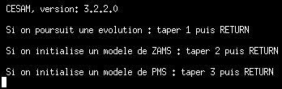
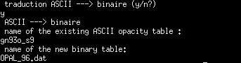
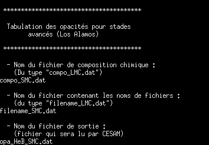
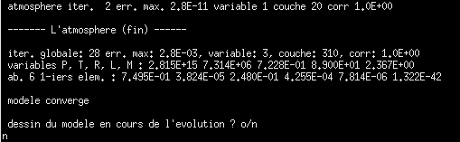
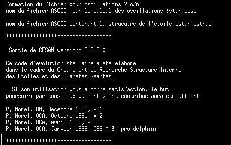
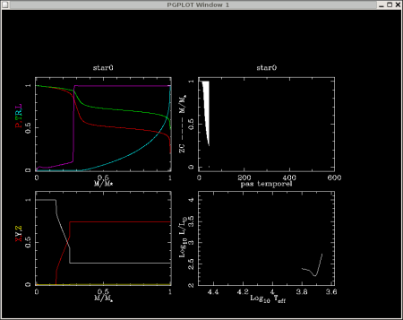

# What is *Yellow* CESAM?

<b><i>Yellow</i> CESAM</b> (hereafter <b><i>Y</i>C</b>) is my personal version of the stellar evolutionary code
CESAM originaly written by Pierre Morel from Nice Observatory (France). Compared
to the official version CESAM 3.2, I did several developments, improvement and
bug corrections (see <a href="http://perso.utinam.cnrs.fr/~cordier/index.php?pw=phd">my Phd Thesis</a> for details).
It is easy to use on <code>Linux</code> machine thanks to the GNU compiler <code>g77</code> (I made a
substantial re-writting effort in order to get a code which can be compiled with <code>g77</code>, that
was not only a question of compiler option).

A <b>database of evolutionary tracks</b> computed with this code (for various chemical
compositions and overshooting amounts) is available on this server
<a href="http://perso.utinam.cnrs.fr/~cordier/index.php?pw=models">here</a>.

I also wrote a <b>web interface</b> to <i>Yellow</i> CESAM, the page about this
project is available on this server 
<a href="http://astro.ensc-rennes.fr/webcesam">here</a>. This kind of web interface can be
adapted to any code, I am currently writting such an interface for various programs like
isochrones maker, population synthesis program, ... for the
<a href="http://basti.obs-besancon.fr">BASTI</a> database.

Finally, for people who are bored by stellar structure and evolution calculations:
relax and read my "<a href="http://perso.utinam.cnrs.fr/~cordier/index.php?pw=funny_physics">Funny Physics</a>" page, 
and enjoy the short movies! It is not necessary to be fluent in french language to understand the purpose of
each experiment.

# How to install *Yellow* CESAM

## Compile the code

 To install <i>Y</i>C, you have to follow these steps:
 
<ul style="circle">
  <li>First of all, download the source code archive here:
            <a href="ycesam.tar.gz">ycesam.tar.gz</a>
  </li>
  <li>gunzip and untar this files: 
  
tar xvfz ycesam.tar.gz
</li>
  <li>go in the <b><code>ycesam</code></b> directory and type: 
  
make
</li> 
  If the <b><code>GNU FORTRAN compiler g77</code></b> (I did not test new
  <code><a href="http://gcc.gnu.org/fortran">g95</a></code>
  compiler yet) is installed on your machine, you should not have any problem during this
  operation. 
  You should get the following library: <code><b>lib_YCesam.a</code></b></li>
  <li>Download the main program source:
  <a href="main_ycesam_std.f">main_ycesam_std.f</a> and compile <i>Y</i>C with a command line
  similar to:
  
g77 -O6 -fno-automatic -fugly-assumed -malign-double -o my_cesam_executable main_ycesam_std.f 
                     lib_YCesam.a -lpgplot -lX11
</li> 
  <b>Notices</b>:
     <ul>
        <li>If you don't have 
	    <b><a href="http://www.astro.caltech.edu/~tjp/pgplot/">PGPLOT library</a></b>
	    or <b>X11 library</b> on your machine: change 
	    <b><code>dess_ol_dig01</code></b> into <b><code>no_des_3</code></b> (that will remove plots
	    during CESAM computations) in <code><b>main_ycesam_std.f</code></b> source.</li>
     </ul>
  </li>
  <li><b>TEST</b> your executable:
  
./my_cesam_executable

  Your should get something like this: 
  

  
  

  </li>
</ul>

## Prepare the Opacity tables

<ul style="circle">
  <li>Opacity tables for a solar mixture (GN93):
  <ul>
      <li>download the following archive: <a href="opa_OPAL96_YL.tar.gz">opa_OPAL96_YL.tar.gz</a>.
      This packages has been originally written by Yveline Lebreton from 
      <a href="http://www.obspm.fr">Paris-Meudon Observatory</a>, I just modified some stuffs for the
      adaptation to <i>Yellow</i> CESAM.</li>
      <li>gunzip and untar the file:
      
tar xvfz opa_OPAL96_YL.tar.gz
</li>
      <li>go in the created <b><code>opa_OPAL96_YL</code></b> directory and compile the FORTRAN
      program <code>fmttobin.f</code>: 
      
make
 
      with g77 this operation should not cause any problem.</li>
      <li>run the program that transform ASCII opacity tables into binary one: 
      
./fmttobin
 
      answer in this spirit:
      

      
      

      <code>gn93o_s9</code> is the ASCII table. The program gives you
      a binary file (named here "<code>OPAL_96.dat</code>") which will be used by <i>Yellow</i> CESAM for its
      calculations.</li>
  </ul>
  </li>
  <li>Opacity tables for He burning core:
  <ul>
      <li>download the following archive: <a href="opacity_He_burning_core.tar.gz">
      opacity_He_burning_core.tar.gz</a></li>
      <li>gunzip and untar the file:
      
tar xvfz opacity_He_burning_core.tar.gz
</li>
      <li>go in one of the created directories, for instance: 
          <code>opacity_He_burning_core/data_SMC/</code>, and type: 
	  
make
 the code should be compiled.
      </li>
      <li>run the opacity table maker program: 
      
./fmaker4.1

      answer like this:
      

      
      

      In this example, "<code>opa_HeB_SMC.dat</code>" is the opacity table which will be
      used as an input file for <i>Y</i>C.
      </li>
      <li>do the same thing in other subdirectories:
         <ul>
	    <li><code>opacity_He_burning_core/data_LMC/</code></li>
	    <li><code>opacity_He_burning_core/data_MW/</code></li>
	 </ul>
      </li>
  </ul>
  </li>
  <li>Now you should have <b>four</b> different opacity tables files, called e.g.:
      <ul>
          <li><code>OPAL_96.dat</code></li>
	  <li><code>opa_HeB_SMC.dat</code></li>
	  <li><code>opa_HeB_LMC.dat</code></li>
	  <li><code>opa_HeB_MW.dat</code></li>
      </ul>
  </li>
</ul>

## Prepare the Nuclear Reaction Rates

<ul>
  <li>download the archive file: <a href="nucreac_rate_tables.tar.gz">nucreac_rate_tables.tar.gz</a></li>
  <li>gunzip and untar this archive following the standard procedure<li>
  <li>go in the "<code>nucreac_rate_tables/</code>" directory and compile the programs: <code><b>./make</b></code>, you
      should get two executables:
      <ul>
         <li><code><b>tab_bin_CF</b></code></li>
	 <li><code><b>tab_bin_NACRE</b></code></li>
      </ul>
 </li>
 <li>If you want to use <b>Caughlan and Fowler</b> nuclear reaction rates, run <code><b>tab_bin_CF</b></code>,
     you have just to specify the ouput file name. If you prefer <b>NACRE</b> rates run
     <code><b>tab_bin_NACRE</b></code>. In both cases you will be prompted for the name of the binary output
     file generated by <code><b>tab_bin_CF</b></code> or <code><b>tab_bin_NACRE</b></code>.
</li>
</ul>

# How to run *Yellow* CESAM
 

## The First Run

<ul>
  <li>As <i>Y</i>C is based on a Newton-Raphson method, one needs a first guess. One
      will find a stellar structure for a 5 solar masses homogeneous model in this
      ASCII files : <a href="m050.dat">m050.dat</a></li>
  <li>make a working directory, for instance: <code><b>myworkingdir</b></code></li>
  <li>copy <a href="m050.dat">m050.dat</a> and this input file:
      <a href="sample_intput_file_YC.don3">sample_intput_file_YC.don3</a> in 
      <code><b>myworkingdir</b></code>. 
      For a commented version of this input file see
      <a href="sample_intput_file_YC.html">here</a> (comments are in blue).    
  </li>
  
  <li>Edit <code><b>sample_intput_file_YC.don3</b></code> and adapt the paths and names corresponding to the
      opacity table files and the nuclear reaction rates file.
  </li>
    
  <li><b>The first run</b>
      <ul>
         <li>the aim is to build an homogeneous model at age 0.00 Myears</li>
	 <li>run <i>Y</i>C:
	 
MYPATH/my_executable

	 </li>
	 <li>question 1: choose <b>2</b> (to make a ZAMS model)</li>
	 <li>question "<b>le modele initial de ZAMS est-il donne en binaire ? o/n</b>": choose "<b>n</b>"
	     ("<code>m050.dat</code>" is an ASCII file)</li>
	 <li>question "<b>entrer le nom du fichier ASCII du modele pris pour modele initial</b>": answer
	     "<code><b>m050.dat</b></code>"</li>
	 <li>question: 
	     "<b>entrer l'identificateur du modele 
	      exemple: soleil_evolue</b>" 
	      give the name of your input file, in our example: <b><code>sample_intput_file_YC</code></b>
	      (without ".don3").
	 </li>
	 <li>The program should run now ... and when the convergence is reached, you should
	     get this message:
	       

  	       
               

	     Answer "o" (yes) or "n" (no) if you want (or not) plots during <i>Y</i>C run. Execution ends
	     with:
	       

  	       
               

	 </li>
      </ul>
  </li>
</ul>

## Next Runs

<ul>
  <li><b>Next runs</b>
      <ul>
         <li>Among output files a "<b>*.hom</b>" file ("<b>*.rep</b>" are equivalent) has been produced.
	     This is a binary file that has to be used to begin the calculation (choice 1 for the first question
	     asked by <i>Y</i>C)</li>
	 <li>If you have chosen the <i>plot option</i> (that requires compilation with PGPLOT
	     ans X11 library), you should get plot as beautiful as this:
	 

  	 
         

	 Chemical composition, pressure, temperature, convective zones extension ... are displayed.
	 </li>
      </ul>
  </li>
</ul>

## Outputs Files

<i>Yellow</i> CESAM produces various output files, the most important are:
<ul>
  <li><code>sample_intput_file_YC.<b>struc</b></code>: internal structure of the last computed model
       during a given stellar evolution (explanations are in the file itself).</li>
       
  <li><code>sample_intput_file_YC.<b>HR</b></code>: several quantities (central temperature/pressure, effective
      temperature, chemical composition (center and surface), ... as a function of time (see <code>ycesam.f</code>
      subroutine or contact me for more detailed information and/or for <code>FORTRAN</code> program which read
      this kind of file).</li>
</ul>

## Other stuff

I also partially rewrote <b>CESAM 4.4</b> in order to get a code which can compiled
with GNU <code>g77</code> compiler (exotic compilation options are not enough).
Beside this I did some personal modifications but my version remains quite close
to the official version (unfortunately I lost the version with only modifications related
to compilation problems). Sources can be downloaded here:
<ul>
   <li>the code itself (with documentation (in french) and various programs):
       <a href="ycesam4.4.tar.gz">ycesam4.4.tar.gz</a></li>
   <li>the "standard" main program: <a href="exe_STD.f">exe_STD.f</a>, it has to be
       compiled with the following include file: <a href="modele.common">modele.common</a></li>
   <li>finally, a sample input file is provided: <a href="sample_input.don4">sample_input.don4</a></li>
</ul>

This code (version with minimum modifications) has been already used by Reza Samadi
(the guy who asked me for modifications), Juan-Carlos Suarez (former PhD Student in Meudon),
Anwesh Mazumdar (former Post-Doc in Meudon Observatory) and Eric Michel.

